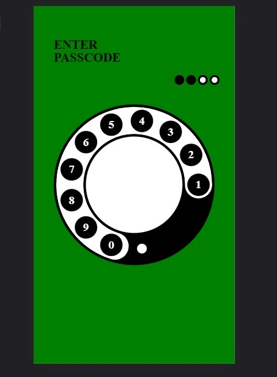

# SVGKit

Draw svg path or custom paths with SVGKit



## INSTALLATION

1.-Add it in your settings.gradle.kts at the end of repositories:
```
dependencyResolutionManagement {
		repositoriesMode.set(RepositoriesMode.FAIL_ON_PROJECT_REPOS)
		repositories {
			mavenCentral() //this
			maven { url 'https://jitpack.io' }  //this
		}
	}
```

2.- 

gradle-wrapper.properties  8.6 to 8.7 

```
distributionBase=GRADLE_USER_HOME
distributionPath=wrapper/dists
distributionUrl=https\://services.gradle.org/distributions/gradle-8.7-bin.zip
zipStoreBase=GRADLE_USER_HOME
zipStorePath=wrapper/dists

```
3.-libs.versions.toml

```
svgkit = "1.2"

jjkit-svgkit = { module = "com.github.Only-IceSoul:jjkit-svgkit", version.ref = "svgkit" }

```
4.-build gradle APP

```
dependencies {


    ///
    implementation(libs.jjkit.svgkit)
}

```


## USAGE


```kotlin


        Mainactivity
        override fun onCreate(savedInstanceState: Bundle?) {
            super.onCreate(savedInstanceState)

            SVGPathParser.setDensity(resources.displayMetrics.density)
            SVGViewBox.setDensity(resources.displayMetrics.density)
            SVGDrawable.setDensity(resources.displayMetrics.density)
            PathDrawable.setDensity(resources.displayMetrics.density)

        }
    
```

```kotlin

  val svgCircle = remember {
        SVGCircle()
            .setR(40f)
            .setCy(25f).setCx(25f)
            .setViewBox(0f,0f,50f,50f)
            .setStrokeColor(m.primary.toArgb())
            .setStrokeWidth(5f)
            .setStrokeEnd(0.5f)
            .setFillColor(Color.Transparent.toArgb())
    }

    Canvas(){

        drawIntoCanvas {

                //SVG DRAWABLE

                //ANIMATION  0 - 1f
                svgCircle.setStrokeStart(  SVGUtil.clamp( 1f - (-animValue.value),0f,1f,1f,0f))
                svgCircle.setStrokeEnd( SVGUtil.clamp( animValue.value,0f,1f,1f,1f)  )

                //SETUP PAINT PATH STROKE
                svgCircle.setup(size.width,size.height)

                //DRAW

                //DRAW A BACKGROUND 
                svgCircle.getStrokePaint().color = myColorGray
                CanvasDrawer.drawPath(it.nativeCanvas,svgCircle.getPath(),svgCircle.getStrokePaint())

                //RESTORE COLOR AND DRAW THE STROKE ANIMATION
                svgCircle.getStrokePaint().color = svgCircle.getStrokeColor()
                svgCircle.draw(it.nativeCanvas)
        }
    }

   
```

 [Example](./example.md)

## LICENSE 

**Apache 2.0**

